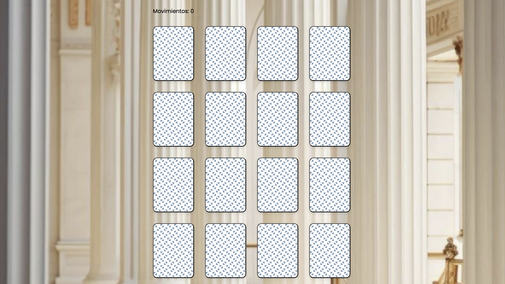

# Juego de Memoria

Este proyecto es un **juego de memoria** donde debes encontrar las parejas de cartas. Está inspirado en obras famosas que uno puede encontrar dentro de museos de renombre.  
Está desarrollado con **HTML**, **CSS**, **JSX**, **Babel** y **JavaScript** para la lógica del juego.

---

## Descripción

El objetivo es encontrar todas las parejas de cartas volteándolas de dos en dos.  

Cuando encuentras una pareja, se mantienen descubiertas.  
Si no coinciden, se voltean nuevamente después de un pequeño retraso.

---

## Tecnologías utilizadas

- HTML
- CSS
- JSX
- Babel
- JavaScript

---

## Estructura del Proyecto

```
/memory-game
│
├── index.html        # Página principal
├── README.md         # Este documento
└── /assets           # Imágenes adicionales
```

---

## Instalación y ejecución

1. **Clona este repositorio** en tu computadora:

   ```bash
   git clone https://github.com/CamiR24/lab7.git
   ```

2. **Accede al directorio** del proyecto:

   ```bash
   cd lab7
   ```

3. **Abre el archivo `index.html`** en tu navegador favorito.

4. **También** puedes acceder al juego en el siguiente link:

   ```bash
   https://23183.dernait.my/lab7/index.html
   ```

---

## Personalización

- **Agregar más cartas:** Solo edita el arreglo de cartas en `script.js`.
- **Cambiar el patrón de fondo:** Modifica el `background-image` en `card` en `styles.css`.
- **Adaptar el diseño:** Ajusta el tamaño de las cartas, colores y animaciones en CSS.

---

## Vista previa





---

## Licencia

Este proyecto está bajo la licencia **MIT**.  
¡Siéntete libre de usarlo, modificarlo o mejorarlo!
